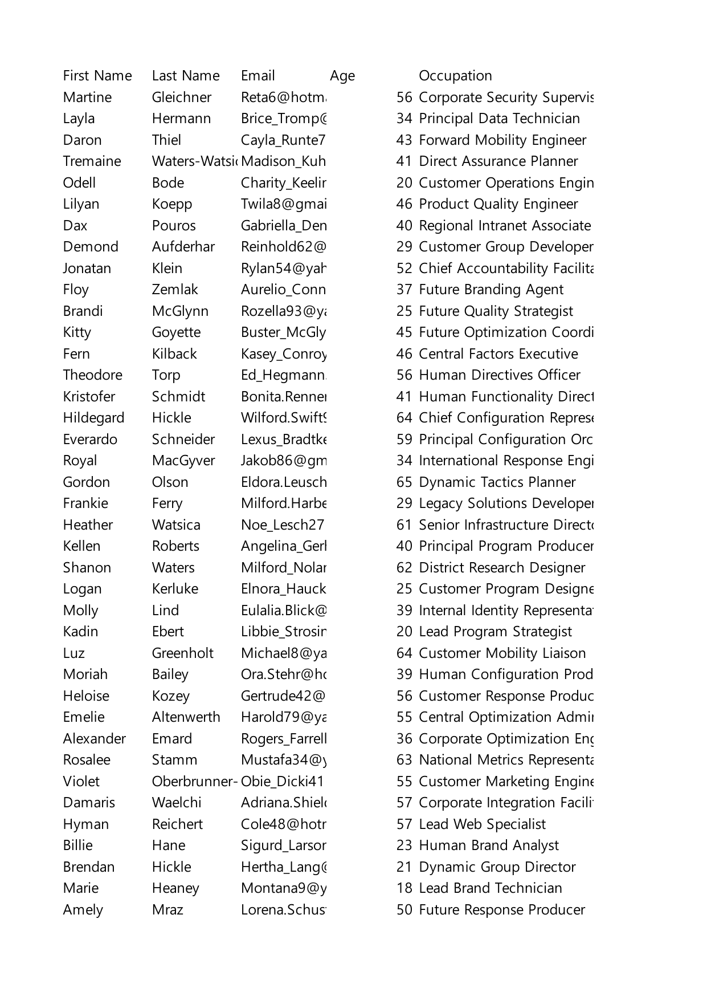

# Issue #1858: re-derived cluster disposition

The #1656 page-1 report remains a frozen snapshot. Its `p1-fc6d6deb9fe7`
disposition to #1660 describes a cut glyph that the native export does not cut.
This recheck does not copy or edit that historical report.

The current `main` output for `100-customers.xlsx` was inspected beside the
archived 150-DPI native Excel page. Both full pages and the crop covering the
old cluster at `(268.80, 616.80pt)` show the trailing `Farrell` text intact at
the column edge. The corresponding current disposition is **absent**; it must
not inherit the historical #1660 note. The 40x40-pixel crop records 76 pixels
outside 5% fuzz. The source, output, crop geometry, hashes, and limits of this
raster-only recheck are in
[`spot-recheck.json`](../../audits/issue-1858/spot-recheck.json).

| Archived native page | Current output page |
| --- | --- |
|  |  |

| Archived native crop | Current output crop | 5% difference |
| --- | --- | --- |
|  |  |  |

The native PDF is not available here. Rewrapping the archived JPEG as a PDF
changes its page box and creates unrelated full-page raster differences, so
this record makes no full-page cluster-census or text-layer claim. The
repository audit rules now require each cluster disposition to be re-derived
from current crops and keep historical reports frozen.
